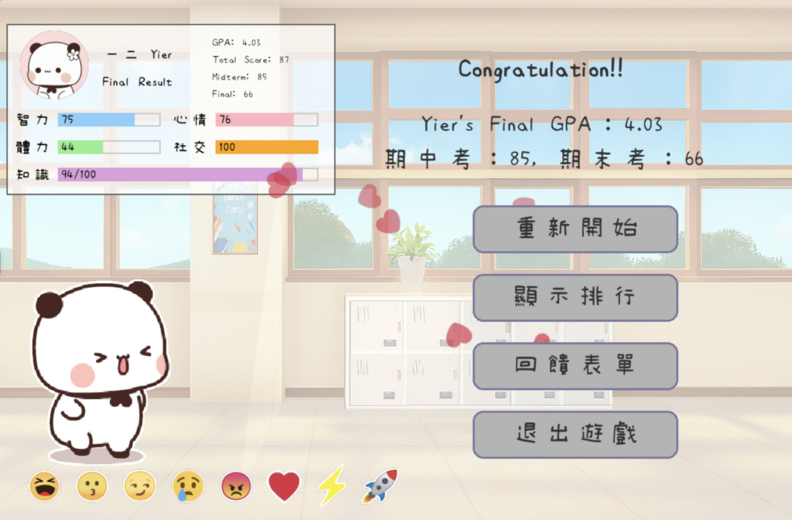
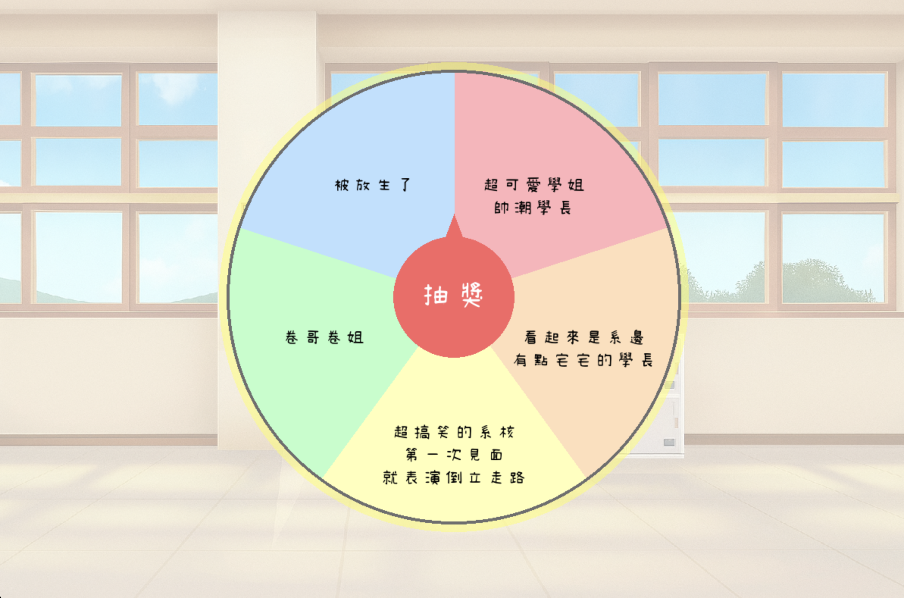
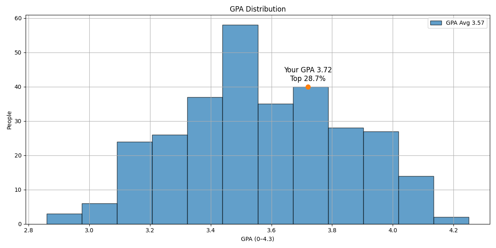

# ✨AOOP Final Project 2025

🌟🌟🌟預計優化項目：
1. 優化程式碼改善遊戲效能
2. 調整各數值及成績的計算方式
3. 利用AI模擬出各個角色的最佳選擇策略


###  Lazy Me Today Too 今天的我也想耍廢😎 ——— 模擬人生大學版

GIF 素材來源：\
[素材來源1](https://www.aigei.com/s?q=一二布布)
[素材來源2](https://www.aigei.com/s?q=蜜桃灰灰) 

<p align="center">
  
</p>


<p align="center">
  
</p>

**本專案為 114-1 陽明交通大學（NYCU）由王學誠老師開設的物件導向程式設計（AOOP）課程的期末成果。專案開發使用 Python, Pygame 的一些函式庫，同樣利用在課程中學習到的函式庫如 numpy, matplotlib等...** 

Group3 開發人員如下：
* NYCU_EE [113511116 tpvupu](https://github.com/tpvupu) : 陳欣怡
* NYCU_EE [113511266 xiaotin22](https://github.com/xiaotin22)：楊庭瑞

## 🌟遊戲介紹

**本遊戲可根據玩家的喜好選擇自己想要的玩家進行遊戲，共有四種選擇，四隻角色具有不同的特色及亮點✨**

<p align="center">
  
</p>

<p align="center">
  
</p>

## 🎉事件選擇與考試結算

**本遊戲會根據不同的事件選擇，對角色狀態的改變，再進行評估成績**

<p align="center">
  
</p>

<p align="center">
  
</p>

<p align="center">
  
</p>

## 🥚小彩蛋 --- 輪盤抽籤

**除了主要的小介面，本專案另設有些小彩蛋，歡迎各位前往遊玩～**

<p align="center">
  
</p>

## 😎模擬大學GPA系統

**使用python 函式庫 matplotlib 畫出由300次隨機選擇的分布圖，角色的每一步選擇都會影響最後的學期GPA**

<p align="center">
  
</p>


## 📂 專案架構 (Project Structure)
``` bash
oop-2025-proj-group10/
│
├── main.py                      # 主程式入口，負責遊戲流程控制
├── character.py                 # 角色類別與屬性、行為邏輯
├── simulation.py                # 用以模擬隨機選擇結果
├── scene_manager.py             # 用以控制Scene之間的切換
├── setting.py                   # 用以設定遊戲參數
│
├── UI/
│   ├── start_scene.py           # 遊戲開場介面
│   ├── intro_scene.py           # 遊戲介紹場景
│   ├── character_select.py      # 角色選擇場景 
│   ├── main_scene.py            # 遊戲主畫面場景
│   ├── story_scene.py           # 劇情推進場景
│   ├── event_scene.py           # 事件觸發場景
│   ├── end_scene.py             # 遊戲結束/結局場景
│   ├── rank_scene.py            # 排行介面
│   ├── lucky_wheel_scene.py     # 幸運轉盤小遊戲
│   ├── diary_scene.py           # 日記本系統
│   ├── ...
│   └── components/
│       ├── audio_manager.py      # 音效/音樂管理單例
│       ├── base_scene.py         # 場景基底類別
│       ├── character_animator.py # 角色動畫管理
│       └── ...                   # 其他 UI 元件
│
├── simulation_plots/            # 模擬成績，繪製圖形存放
│
├── resource/
│   ├── font/                    # 字型檔案
│   ├── image/                   # 圖片、背景、角色圖
│   └── music/
│       ├── bgm/                 # 背景音樂
│       └── sound_effect/        # 音效檔案
│
├── event/
│   ├── event.json               # 各週事件資料
│   └── game_setting/            # 遊戲劇情文件
│ 
├── README.md                    # 專案說明文件
├── Docker/
```
---
## [Class Diagram](./event/game_setting/class_diagram.md)

## 🛠️ 安裝與執行 (建置虛擬環境版）

如果想要在自己的本機執行這個遊戲，請依照下列步驟執行呦～

### 必要條件

* Python 3.12 + 
* Git
  
### 安裝步驟

1.  **Clone 專案庫**
    ```bash
    git clone https://github.com/xiaotin22/oop-2025-proj-group10.git
    cd oop-2025-proj-group10
    ```

2.  **建立並啟用虛擬環境 (強烈建議)**
    * 在 Windows 上:
        ```bash
        python -m venv venv
        .\venv\Scripts\activate
        ```
    * 在 macOS / Linux 上:
        ```bash
        python3 -m venv venv
        source venv/bin/activate
        ```

3.  **安裝相依套件**
    ```bash
    pip install -r Docker/requirements.txt
    ```

4.  **執行遊戲！**
    ```bash
    python main.py
    ```
---


# About Our Docker 🚀
**除了上述的虛擬環境，也可以使用我們建置的 Docker ~**

🧰 前置需求（第一次才需要）

### Step1 : 安裝 Docker (如果沒有裝過的話)  
   [👉 Docker 官方下載連結](https://www.docker.com/products/docker-desktop)

### Step2: Clone 這個 repo 到你的電腦：
```
cd ~
git clone https://github.com/xiaotin22/oop-2025-proj-group10.git
cd oop-2025-proj-group10
```
### Step3: 進入Docker
```
source docker_run.sh
```


