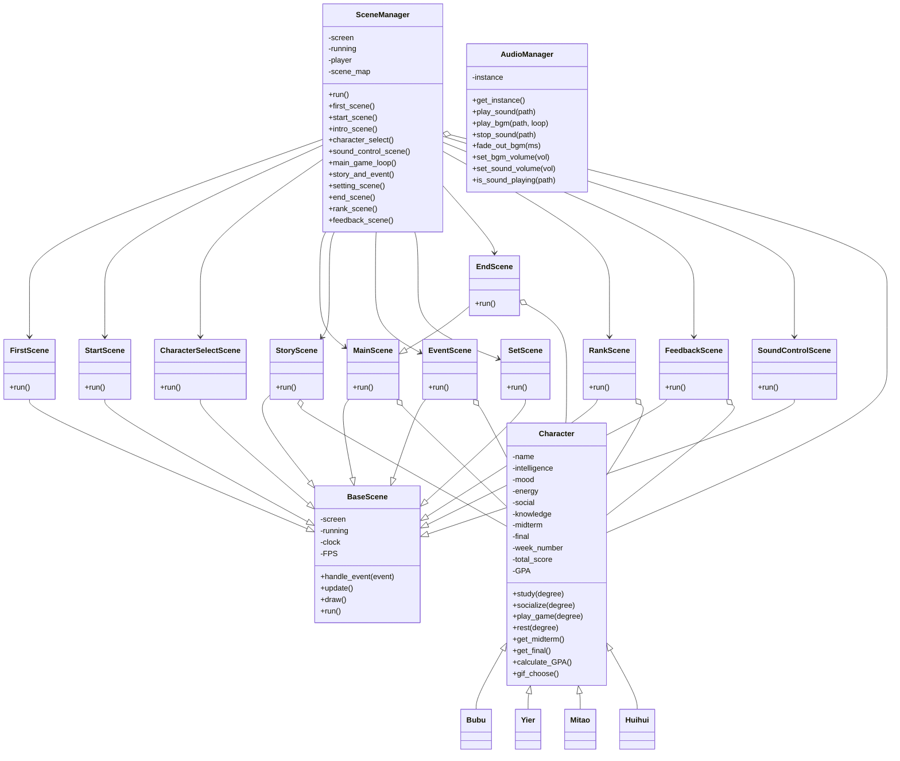

```mermaid
classDiagram
    class SceneManager {
        -screen
        -running
        -player
        -scene_map
        +run()
        +first_scene()
        +start_scene()
        +intro_scene()
        +character_select()
        +sound_control_scene()
        +main_game_loop()
        +story_and_event()
        +setting_scene()
        +end_scene()
        +rank_scene()
        +feedback_scene()
    }

    class AudioManager {
        -instance
        +get_instance()
        +play_sound(path)
        +play_bgm(path, loop)
        +stop_sound(path)
        +fade_out_bgm(ms)
        +set_bgm_volume(vol)
        +set_sound_volume(vol)
        +is_sound_playing(path)
    }

    class BaseScene {
        -screen
        -running
        -clock
        -FPS
        +handle_event(event)
        +update()
        +draw()
        +run()
    }

    class FirstScene {
        +run()
    }
    class StartScene {
        +run()
    }
    class CharacterSelectScene {
        +run()
    }
    class MainScene {
        +run()
    }
    class StoryScene {
        +run()
    }
    class EventScene {
        +run()
    }
    class SetScene {
        +run()
    }
    class EndScene {
        +run()
    }
    class RankScene {
        +run()
    }
    class FeedbackScene {
        +run()
    }
    class SoundControlScene {
        +run()
    }

    class Character {
        -name
        -intelligence
        -mood
        -energy
        -social
        -knowledge
        -midterm
        -final
        -week_number
        -total_score
        -GPA
        +study(degree)
        +socialize(degree)
        +play_game(degree)
        +rest(degree)
        +get_midterm()
        +get_final()
        +calculate_GPA()
        +gif_choose()
    }
    class Bubu
    class Yier
    class Mitao
    class Huihui

    SceneManager --> FirstScene
    SceneManager --> StartScene
    SceneManager --> CharacterSelectScene
    SceneManager --> MainScene
    SceneManager --> StoryScene
    SceneManager --> EventScene
    SceneManager --> SetScene
    SceneManager --> EndScene
    SceneManager --> RankScene
    SceneManager --> FeedbackScene
    SceneManager --> SoundControlScene

    FirstScene --|> BaseScene
    StartScene --|> BaseScene
    CharacterSelectScene --|> BaseScene
    MainScene --|> BaseScene
    StoryScene --|> BaseScene
    EventScene --|> BaseScene
    SetScene --|> BaseScene
    EndScene --|> MainScene
    RankScene --|> BaseScene
    FeedbackScene --|> BaseScene
    SoundControlScene --|> BaseScene

    Character <|-- Bubu
    Character <|-- Yier
    Character <|-- Mitao
    Character <|-- Huihui

    SceneManager o-- Character
    MainScene o-- Character
    StoryScene o-- Character
    EventScene o-- Character
    EndScene o-- Character
    RankScene o-- Character
    FeedbackScene o-- Character
```